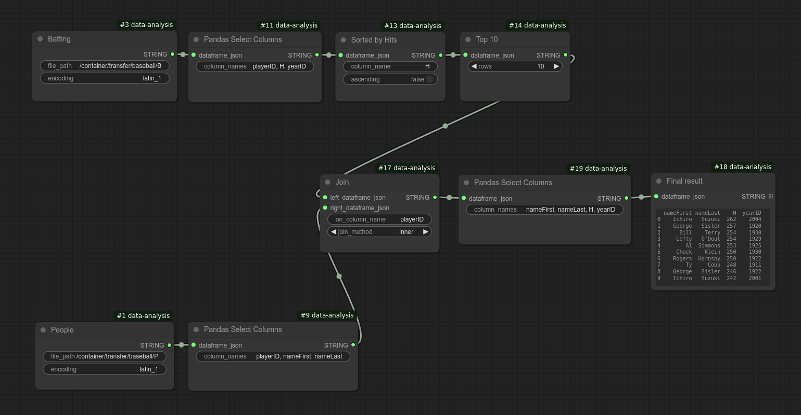

# ComfyUI-Data-Analysis

## How Can We Figure Out Which MLB Player Had the Most Hits Per Year?

If you love ComfyUI, it's likely because of its incredible flexibility—allowing you to customize workflows to achieve exactly the results you want, primarily in image generation.  

ComfyUI was designed to make Stable Diffusion accessible to non-engineers while offering extensive customization. However, it doesn’t natively support structured data like baseball statistics. That’s why I created this ComfyUI extension—to bridge that gap.  

This project is still in the conceptual stage, with limited Pandas and Matplotlib functionality, but it works. At the end of this page, you’ll find a tutorial on how to use this package to answer the MLB hits question.  

I hope you enjoy using it and have a great time exploring data.  

— Hide Inada  

<hr>



ComfyUI-Data-Analysis is a custom module for analyzing data using Pandas and Matplotlib within ComfyUI.

Here are some of the included nodes:

- Loading a CSV file as a DataFrame
- Saving a DataFrame to a CSV file
- Selecting a subset of columns from a DataFrame
- Selecting a subset of rows from a DataFrame by specifying a filter condition
- Sorting a DataFrame by a column
- Displaying the content of a DataFrame
- Extracting the first part of a DataFrame
- Joining two DataFrames (inner, left, right, outer joins)
- Outputting statistics of a DataFrame (e.g., standard deviation)
- Line plot
- Scatter plot
- Bar chart

You can connect these nodes to conduct complex analysis in an intuitive graphical way.  
You can also use other Comfy custom nodes to fit your needs (e.g., combining images).

These custom nodes aim to make data exploration and analysis more efficient and enjoyable.

## Installation
Note: GPU is not required to run this custom module.

### Installation via ComfyUI Manager
1. Press Manager button on the top menu bar to display ComfyUI Manager Menu.
2. Click Custom Node Manager.
3. In the search field, enter Data analysis.
4. "ComfyUI-Data-Analysis" should be displayed. Select Install.
5. Restart ComfyUI.
6. Reload browser page.

### Installation via git
1. Navigate to the `custom_nodes` directory within your ComfyUI installation.
2. Run the following command:

    ```bash
    git clone https://github.com/HowToSD/ComfyUI-Data-Analysis.git
    ```
    This will create a new subdirectory ComfyUI-Data-Analysis.
3. Rename the folder name from ComfyUI-Data-Analysis to data-analysis.
   If you skip this, example workflows will not work as those flows use this folder name.
4. Check if your ComfyUI environment already has pandas and matplotlib. If not, install them using pip.
   ```
   pip install -r requirements.txt
   ```
   Refer to requirements.txt for the right versions.
5. Start ComfyUI.

### Troubleshooting for installation
This custom node module requires pandas and matplotlib, which are not included in the default ComfyUI installation. If you install this module using ComfyUI Manager, these packages should be installed automatically. However, if installation fails, refer to the pandas and matplotlib documentation for manual installation.

## How to Use
Refer to [User's Guide](docs/ug.md)

For a practical example, see the tutorial on baseball data: [How to Find Out Who Had the Most Hits](docs/baseball_example1.md).

## Note  
The cover baseball image was generated using FLUX.1-dev. **Commercial use of this image is not permitted.**