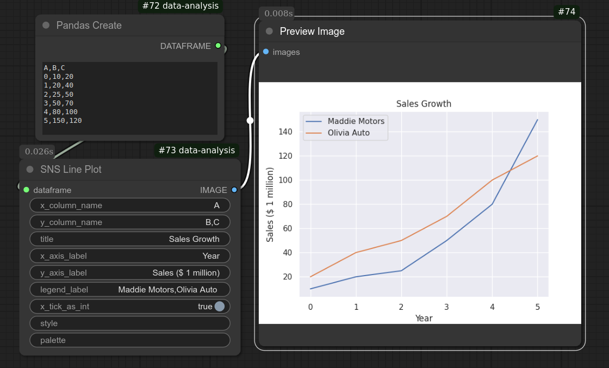
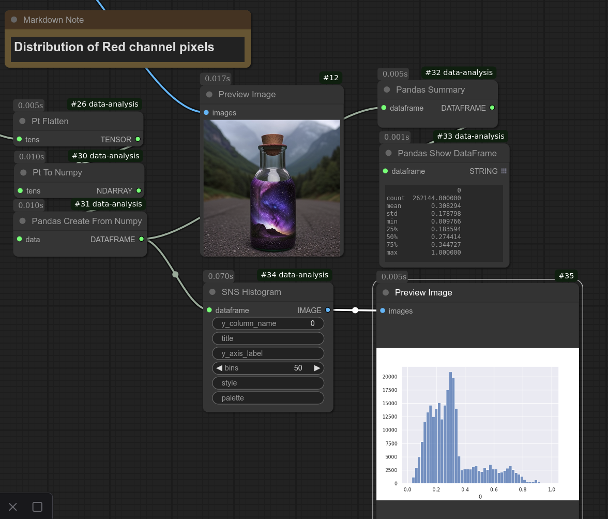

# ComfyUI-Data-Analysis
## Update (March 10, 2025)
All PyTorch nodes have been moved to a separate extension. If you're using PyTorch wrappers, install the [ComfyUI-Pt-Wrapper extension](https://github.com/HowToSD/ComfyUI-Pt-Wrapper).
---

## How Can We Figure Out Which MLB Player Had the Most Hits Per Year?

If you love ComfyUI, it's likely because of its incredible flexibility—allowing you to customize workflows to achieve exactly the results you want, primarily in image generation.  

ComfyUI was designed to make Stable Diffusion accessible to non-engineers while offering extensive customization. However, it doesn’t natively support structured data like baseball statistics. That’s why I created this ComfyUI extension—to bridge that gap.  

At the end of this page, you’ll find a tutorial on how to use this package to answer the MLB hits question.  

I hope you find it useful and engaging for data exploration.

— Hide Inada  

<hr>


**ComfyUI-Data-Analysis** is an extension for ComfyUI that provides custom nodes for data analysis using Pandas, Seaborn, and Matplotlib within ComfyUI.
Especially, this is suited if you want to analyze structural data (tabular data) using ComfyUI's node system.

## Features

**ComfyUI-Data-Analysis** includes numerous custom nodes that wrap Pandas, Matplotlib and Seaborn.
For a complete list, see the [Node Reference](docs/reference/node_reference.md).

These nodes allow you to conduct complex analyses in an intuitive, graphical way. You can also combine them with other ComfyUI custom nodes to fit your workflow needs (e.g., integrating images).

## Visualization & Analysis

These custom nodes enhance efficiency and usability in data exploration and visualization. Creating sample data and plotting it is incredibly simple:

  
*Example plot*

Additionally, you can analyze images generated in ComfyUI’s workflows. Below is an example of a histogram showing the red channel pixel distribution (Note that you will also need a companion extension [ComfyUI-Pt-Wrapper extension](https://github.com/HowToSD/ComfyUI-Pt-Wrapper) to access PyTorch tensors as shown in below screenshot):



## Installation
Note: GPU is not required to run this custom module.

### Installation via ComfyUI Manager
1. Press Manager button on the top menu bar to display ComfyUI Manager Menu.
2. Click Custom Node Manager.
3. In the search field, enter Data analysis.
4. "ComfyUI-Data-Analysis" should be displayed. Select Install.
5. Restart ComfyUI.
6. Reload browser page.

### Installation via git
1. Navigate to the `custom_nodes` directory within your ComfyUI installation.
2. Run the following command:

    ```bash
    git clone https://github.com/HowToSD/ComfyUI-Data-Analysis.git
    ```
    This will create a new subdirectory ComfyUI-Data-Analysis.
3. Rename the folder name from ComfyUI-Data-Analysis to data-analysis.
   Skipping this step will cause example workflows to fail, as they rely on this folder name.
4. Check if your ComfyUI environment already has required packages listed in requirements.txt. If not, install them using pip.
   ```
   pip install -r requirements.txt
   ```
   Refer to requirements.txt for the right versions.
5. Start ComfyUI.

### Troubleshooting for installation
This custom node module requires pandas and matplotlib, which are not included in the default ComfyUI installation. If you install this module using ComfyUI Manager, these packages should be installed automatically. However, if installation fails, refer to the pandas and matplotlib documentation for manual installation.

## How to Use
Refer to [User's Guide](docs/ug.md) or check out [Node Reference](docs/reference/node_reference.md)

For a practical example, see the tutorial on baseball data: [How to Find Out Who Had the Most Hits](docs/baseball_example1.md).

## Update
Refer to the release notes. While backward-incompatible changes are minimized, some may be necessary. The release notes contain those changes so that you know what to expect before upgrading your version.

## Contribution
🚫 **This project does not accept pull requests.**  
Unsolicited PRs will be **closed without review**.  

If you have a feature request or improvement suggestion, **please create an Issue instead**.  
All submitted issues will be reviewed and prioritized accordingly.

## Note  
The cover baseball image was generated using FLUX.1-dev. **Commercial use of this image is not permitted.**