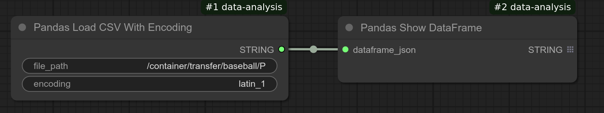

# Baseball Example
This tutorial provides a practical example of using ComfyUI Data Analysis (CDA) to obtain meaningful results.

The objective is to determine which Major League Baseball player has the most hits per year.

Fortunately, the [Lahman Baseball Database](http://seanlahman.com/) contains the necessary data, and CDA simplifies the extraction process. Let's dive in.

# Obtaining data
Our first step is to obtain data.
1. Access http://seanlahman.com/.
2. Select Comma-delimited version of the baseball data.
3. Download the data file. File name should be lahman_1871-2023_csv.7z.
4. Using 7zip, extract the content.
5. We need two files:
   * Batting.csv
   * People.csv
6. Make a note of the absolute file path of these files as we need to specify them in nodes later.

# Loading Data
1. Open a new blank workflow.


2. Double-click on the canvas.
   The search nodes window should pop up.
  

3. Type "Pandas Load".
   You should see three nodes that start with this prefix:
  

4. Select Pandas Load CSV With Encoding.
   Then this node is added to the canvas.
   

5. Click file_path and enter the absolute file path of the People.csv that you noted previously.

6. Enter "latin_1" in the Encoding field.  The reason why this parameter is needed is People.csv contains a non-ASCII character(s) that are not encoded in utf-8, which is the standard encoding today. In the US and Western Europe, "latin_1" can be used for data that was created or collected before utf-8 became the standard.
   CDA has a node called Load CSV which assumes that data is encoded in utf-8. If you use this node for People.csv, it would throw an error because of this encoding mismatch.
   


7. Now double-click the canvas to open Search Nodes window again. Look for Pandas Show DataFrame node and add it to the workflow.

   

8. Drag the mouse from the String output of the Load CSV node to the dataframe json input of the Show DataFrame node to make a connection.
   

9. Now press the Queue button to run the workflow. When the workflow finishes running, resize the Show DataFrame node to make it bigger to fit the content.  (Note that some information is masked in the screenshot below even though they are publicly available to err on the safe side.)
   

10. Let's repeat the process for batting data. Copy and paste these two nodes (or you can just create new if you are not familiar with how to copy and paste). Change the file path to Batting.csv. Clicking the Queue button again will display the batting data.
   

Congratulations! You are done with loading data.  In the next section, we will be covering how to extract relevant data from these two tables.

# Extracting data from People table
The data we loaded contain a lot of rows.
If you see the screenshots, you can see that People data has more than 21000 rows and Batting data contains more than 113 thousand rows! We are only interested in a super small part of this, so let's trim the data.

1. Figuring out which columns to use to extract names

   First we want to extract the names from People data. The reason for this is that Batting table contains the ID of the player and not the full name. So we need names defined in the People table. But how do we do this? If we take a look at the screenshot, you do not see full name columns. It looks like the column names are hidden. So we need to first figure out what columns are avaialbe in the People table.
   To do so, add a new node **Pandas Columns** and connect it to Load CSV for People.
   Then add another node **Pandas Show Text** and connect it to the Pandas Columns node. Press Queue, you should see below.

   

   Now you see nameFirst, nameLast columns. Let's use these. We also need playerID to connect to the data in Batting table.

2. Extracting name columns

   Now that we know the names of columns, let's extract columns using these.
   Create a new node **Pandas Select Columns** and enter:
   ```
   playerID, nameFirst, nameLast
   ```
   Then add another node **Pandas Show DataFrame** and connect it to the Pandas Select Columns node. 
   Press Queue. You should see output like below:
   

   We are done with extracting required data for people.  We will be using this in the final step when we combine this with the output from the modified Batting data.

# Extracting data from Batting table

1. Extracting relavant columns

   For Batting data, looking at the screenshot, we know that we can use:
   * playerID
   * H
   * yearID
  
   So let's create a new node **Pandas Select Columns** and enter:
   ```
   playerID, H, yearID
   ```
   Make a connection between the Load CSV node for Batting and this newly created node.
   Then add another node **Pandas Show DataFrame** and connect it to the Pandas Select Columns node. 
   Press Queue. You should see output like below:
   

2. Sorting the data
   
   We are only interested in who hit the most hits. So let's sort the table so that player who hit the most will appear first. To do so, we need to sort the table in a descending manner on the H (hits) column.

   Add another node **Pandas Sort** and connect it to the Pandas Select Columns node.
   Enter H and select ascending to False (which means "descending").
   Press Queue. You should see output like below:
   

   Great, we now have the result. The top row shows:
   ```
   suzukic01  262    2004
   ```
   Let's do a little clean up. First, let's pick top 10 as the table still contains more than 113 thousand records.

3. Extracting top 10 records

   Add another node **Pandas Head** and connect it to the Pandas Sort node.
   Enter 10.
   Press Queue. You should see output like below:
   
   We are almost done except that names are not the actual names. Let's address that.

# Fixing names - Joining tables
In this final section, we will be fixing the name issue where the names are IDs and not real names. To do so, we will be combining the data from the modified People table with the modified Batting table. This process of combining is called "joining". To join two tables, we need to have a common column to match data from two tables. Fortunately, we have the playerID column in both tables which we will be using in the below steps.

1. Adding a Join node

   Add a node **Pandas Join**.
      

   Drag it next to the **Select Colums** node of the Batting table.
   Connect the output of the Head node to the "left_dataframe_json" input of the join node.

2. Connect to the People table

   Now drag the join node so that it sits next to the **Select Colums** node of the People table.
   Connect the output of the Select Columns node to the "right_dataframe_json" input of the join node. Note that you may need to hover your mouse around the top-left corner of the blank area that contains "right_dataframe_json" to find the connection point.

   

3. On the join node, enter playerID in the **on column name** field.
   

4. Add **Pandas Show DataFrame** and connect it to the join node.
   Press Queue. You should see output like below:

   

5. We no longer need the playerID column so let's add Select Columns node to just select what we want:

   

We are done!
We added multiple nodes to verify each step, but we don't need them now that we get the result. After we remove all those nodes, here is the final result.

   

## Acknowledgement
Data from Lahman Baseball Database (http://seanlahman.com/) is used in this tutorial and the workflow.

Reprint of the copyright notice and license for data:
```
This database is copyright 1996-2024 by Sean Lahman.

This work is licensed under a Creative Commons Attribution-ShareAlike 3.0
Unported License. For details see: http://creativecommons.org/licenses/by-sa/3.0/
```