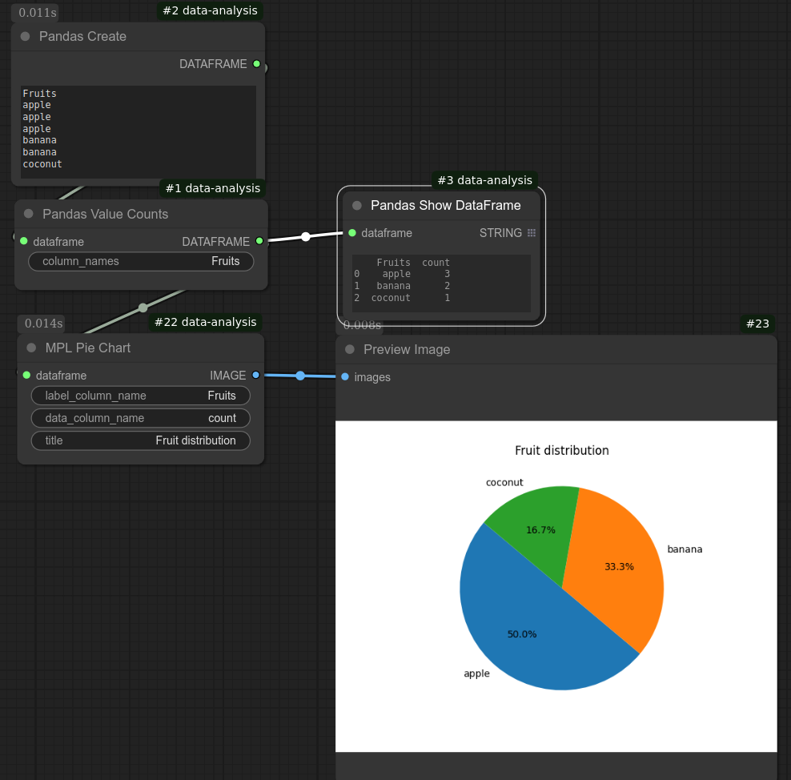

# M P L Pie Chart
:MPL Pie Chart
Generates a pie chart from a pandas DataFrame.

Below screenshot shows a workflow to generate a pie chart from categorical data.

## Input
| Name | Data type |
|---|---|
| dataframe | DataFrame |
| label_column_name | String |
| data_column_name | String |
| title | String |

## Output
| Data type |
|---|
| Image |

Category: Plot

ComfyUI Data Analysis Node Reference. © 2025 Hide Inada (HowToSD.com). All rights reserved.
