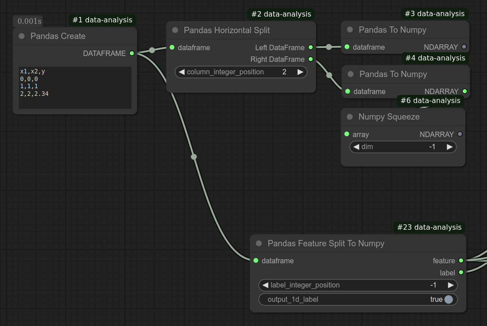

# Pandas Feature Split To Numpy
Splits a Pandas DataFrame into feature Numpy ndarray and label Numpy ndarray.
If output_1d_label is set, label will be output as a 1d array instead of a 2d array.

As shown in the below screenshot, this node can replace multiple nodes that are used to split Pandas DataFrame into two DataFrames, convert to NumPy, then squeeze the label data. 

## Input
| Name | Data type |
|---|---|
| dataframe | DataFrame |
| label_integer_position | Int |
| output_1d_label | Boolean |

## Output
| Data type |
|---|
| Ndarray |
| Ndarray |

Category: Transformation

ComfyUI Data Analysis Node Reference. © 2025 Hide Inada (HowToSD.com). All rights reserved.
