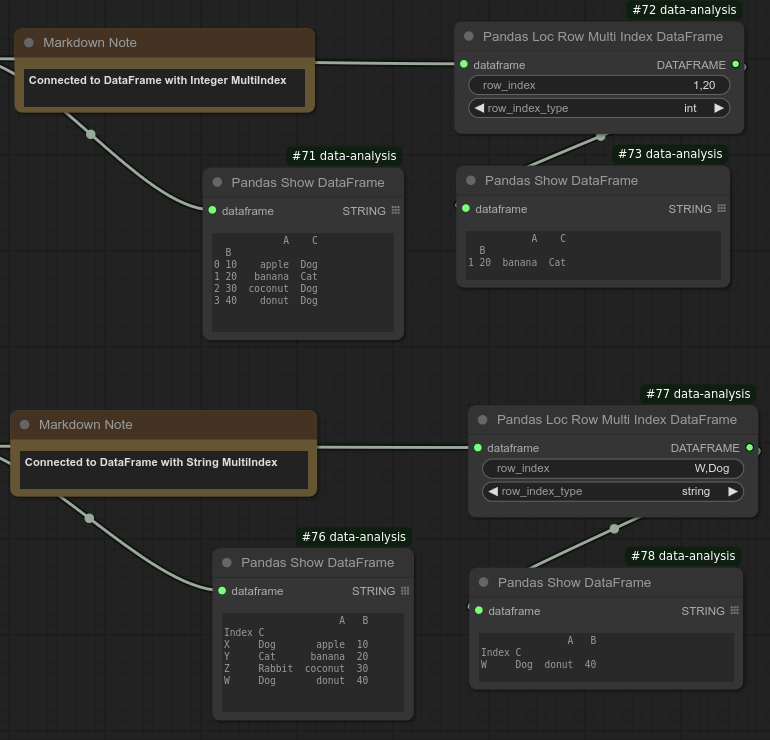

# Pandas Loc Row Multi Index Data Frame
Selects a row from a pandas DataFrame with MultiIndex and output as a DataFrame.

Specify comma-separated MultiIndex labels (row index) and the data type for the MultiIndex to select a row.

Below screenshots illustrate these options:

The top DataFrame has an integer-type MultiIndex, while the bottom DataFrame has a string-type MultiIndex. In both cases, two index values are specified to select a single row while the correct MultiIndex data type is also selected. Note that mixed data types for MultiIndex are not currently supported.

## Input
| Name | Data type |
|---|---|
| dataframe | DataFrame |
| row_index | String |
| row_index_type |  |

## Output
| Data type |
|---|
| DataFrame |

Category: Data subset selection

ComfyUI Data Analysis Node Reference. © 2025 Hide Inada (HowToSD.com). All rights reserved.
