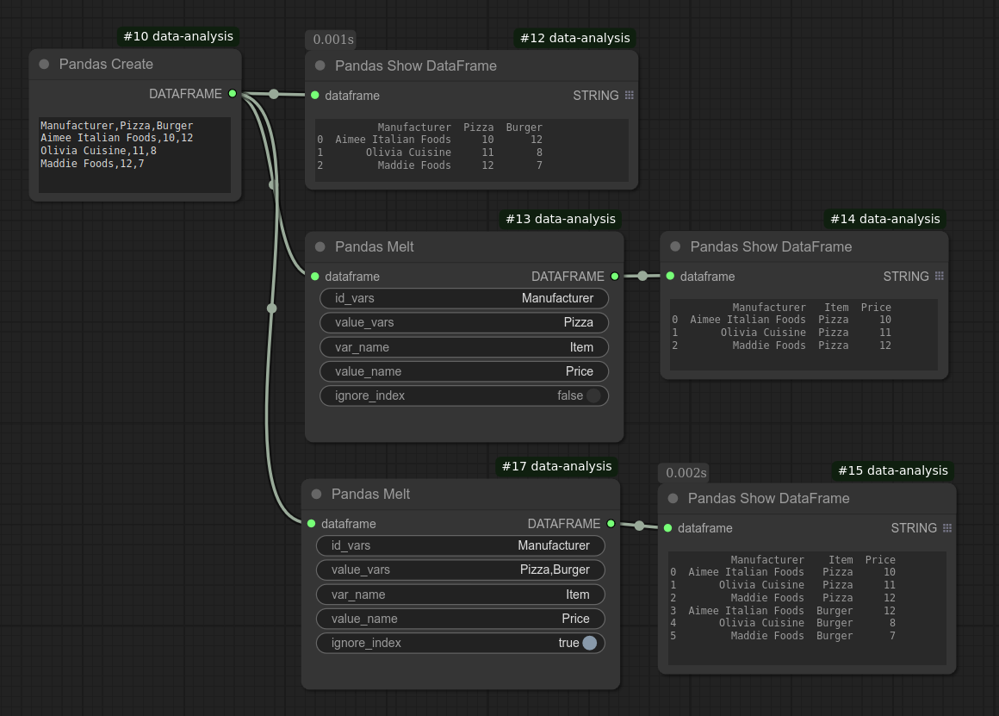

# Pandas Melt
Performs an unpivot operation (melt) on a pandas DataFrame.

## Understanding Melt (Unpivot)
The melt operation converts a DataFrame from **wide format** (where multiple columns represent separate variables) into **long format** (where values are stacked under a single column).

### Example: Frozen Food Prices Table

Given the following DataFrame:

```
Frozen Food Prices

Manufacturer                   Pizza        Burger
---------------------------------------------------
Aimee Italian Foods               10            12
Olivia Cuisine                    11             8
Maddie Foods                      12             7
```

To demonstrate **melting a single column**, we will **only transform the `"Pizza"` column** and **temporarily exclude `"Burger"`** from the output. `"Burger"` is not affected in this step because we are only selecting `"Pizza"` for melting.

```
Frozen Food Prices

Manufacturer                   X                Y
---------------------------------------------------
Aimee Italian Foods            Pizza            10
Olivia Cuisine                 Pizza            11
Maddie Foods                   Pizza            12
```

Here:

- Column `X` is assigned to `"Item"` (`var_name`).
- Column `Y` is assigned to `"Price"` (`value_name`).
- `"Pizza"` is explicitly specified in `value_vars` as the column being unpivoted.
- `"Manufacturer"` remains unchanged and is included in `id_vars` to preserve row identity.

The final transformed DataFrame:

```
Frozen Food Prices

Manufacturer                   Item            Price
----------------------------------------------------
Aimee Italian Foods            Pizza            10
Olivia Cuisine                 Pizza            11
Maddie Foods                   Pizza            12
```

### Expanding the Melt Operation

If we want to **melt both `"Pizza"` and `"Burger"` together**, we specify both columns in `value_vars`:

```
Frozen Food Prices

Manufacturer                   Item           Price
----------------------------------------------------
Aimee Italian Foods            Pizza            10
Olivia Cuisine                 Pizza            11
Maddie Foods                   Pizza            12
Aimee Italian Foods            Burger           12
Olivia Cuisine                 Burger            8
Maddie Foods                   Burger            7
```

Here, we explicitly define:

- `"Pizza"` and `"Burger"` in `value_vars`.
- A new `"Item"` column (`var_name`), which holds the original column names (`"Pizza"`, `"Burger"`).
- A `"Price"` column, which stores the corresponding values.

To specify both columns in this node, provide:

```
Pizza,Burger
```

This node automatically converts the string into a list and passes it to `pandas.DataFrame.melt()`.




Refer to the [Pandas documentation](https://pandas.pydata.org/docs/reference/api/pandas.DataFrame.melt.html) for more information.

## Limitation
MultiIndex columns are not supported.

## Input
| Name | Data type |
|---|---|
| dataframe | DataFrame |
| id_vars | String |
| value_vars | String |
| var_name | String |
| value_name | String |
| ignore_index | Boolean |

## Output
| Data type |
|---|
| DataFrame |

<HR>
Category: Transformation

ComfyUI Data Analysis Node Reference. © 2025 Hide Inada (HowToSD.com). All rights reserved.
