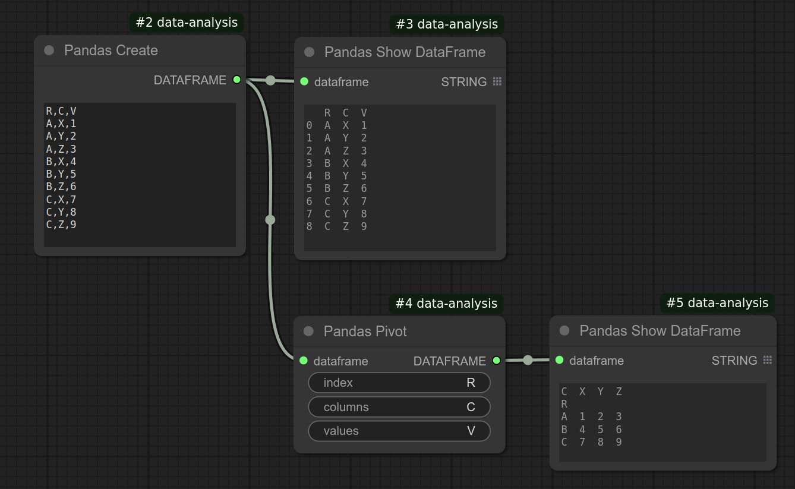

# Pandas Pivot
Computes a pivot table from a pandas DataFrame.

## Note on a pivot table
A pivot table is easier to understand if we start off from the table itself:  
In the below DataFrame:

```
   Column labels
    X  Y  Z
Index
A   1  2  3
B   4  5  6
C   7  8  9
```

We have index `["A", "B", "C"]` and column labels `["X", "Y", "Z"]`.  
Values in this DataFrame can be accessed by specifying the index and the column label.  
For example:

```python
df.loc["A", "X"]  # 1
df.loc["A", "Y"]  # 2
```

Now, let's restructure the table by converting column labels into row values:

```
A   X  1
A   Y  2
A   Z  3
B   X  4
B   Y  5
B   Z  6
C   X  7
C   Y  8
C   Z  9
```

Let's add a column label to each of these columns:

```
R   C  V
--------
A   X  1
A   Y  2
A   Z  3
B   X  4
B   Y  5
B   Z  6
C   X  7
C   Y  8
C   Z  9
```

Now, the first two columns uniquely identify the value in the third column.

**Pivoting** is the reverse of this operation.  
- You start with the table above and produce the original one.  
- In pandas, this means telling it to use:
  - R column: `A`, `B`, `C` as the index (row labels).
  - C column: `X`, `Y`, `Z` as the column labels.
  - V column: The numbers (`1, 2, 3, ...`) as the values for each cell indexed by `[A, B, or C]` and `[X, Y, or Z]`.

This can be done using:

```python
df.pivot(index="R", columns="C", values="V")
```

The result:

```
   X  Y  Z
A  1  2  3
B  4  5  6
C  7  8  9
```

Now the data is back to its original, structured form.



## Input
| Name | Data type |
|---|---|
| dataframe | DataFrame |
| index | String |
| columns | String |
| values | String |

## Output
| Data type |
|---|
| DataFrame |

<HR>
Category: Transformation

ComfyUI Data Analysis Node Reference. © 2025 Hide Inada (HowToSD.com). All rights reserved.
