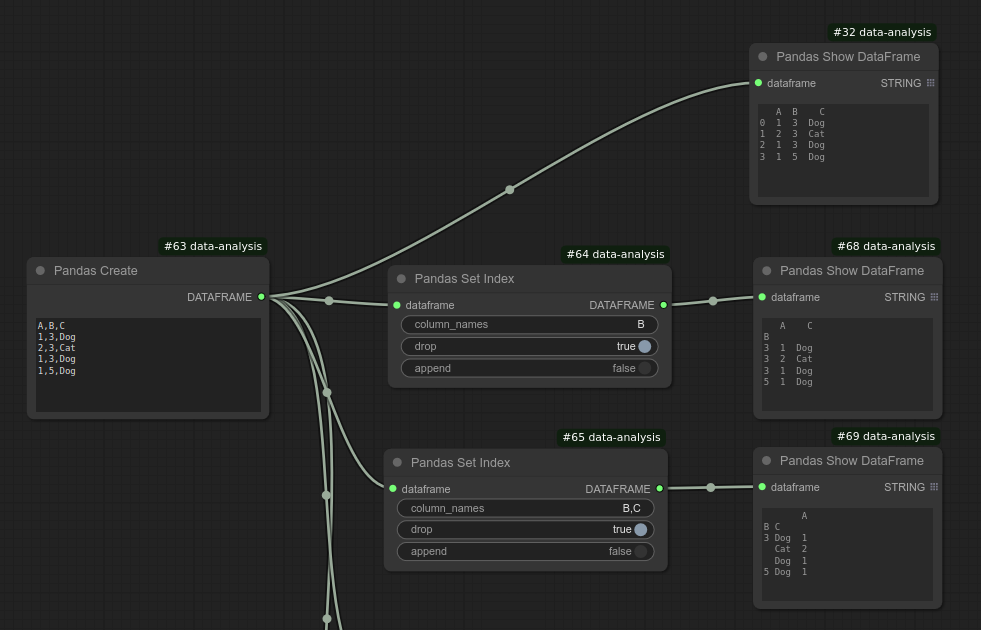
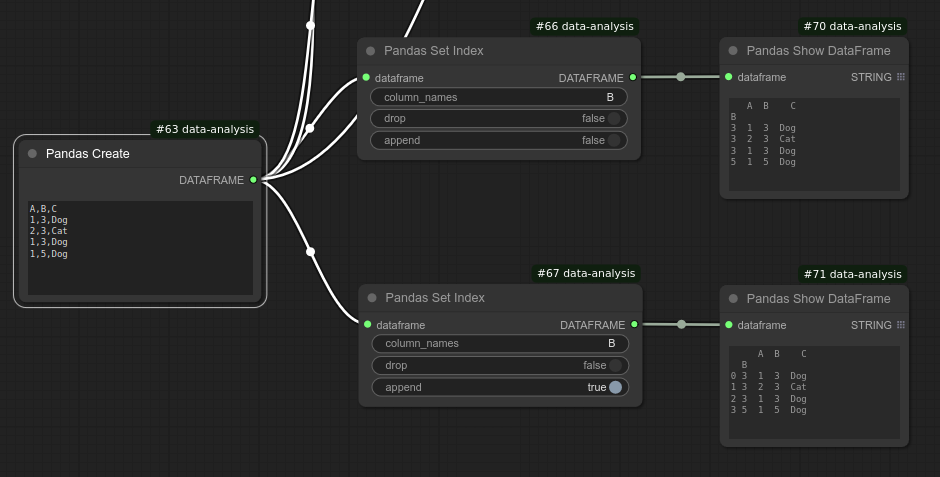

# Pandas Set Index
Create index (row label) from existing column or columns.

You can specify a single column or a comma-separated list of column labels in `column_names`.  
If `drop=True`, the specified columns are removed from column labels and become the index.  
If `drop=False`, the columns remain in the DataFrame column labels while also being used as the index.  
If `append=True`, the new index is added alongside the existing index.

Below screenshots illustrate these options:

This class internally calls `pandas.DataFrame.set_index()`.

## Input
| Name | Data type |
|---|---|
| dataframe | DataFrame |
| column_names | String |
| drop | Boolean |
| append | Boolean |

## Output
| Data type |
|---|
| DataFrame |

Category: Transformation

ComfyUI Data Analysis Node Reference. © 2025 Hide Inada (HowToSD.com). All rights reserved.
