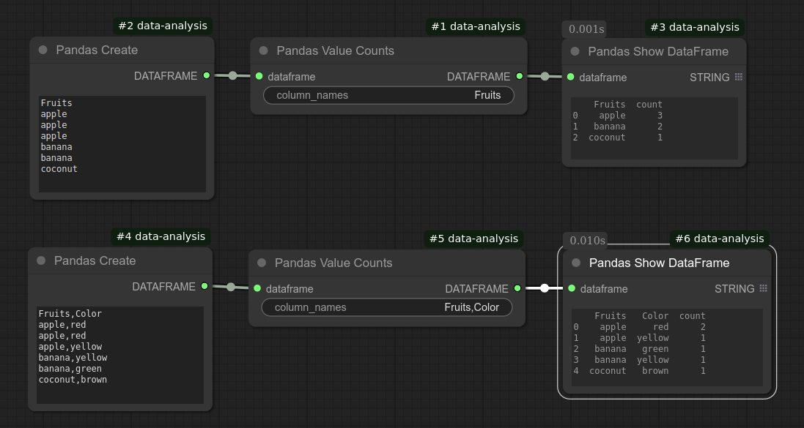

# Pandas Value Counts
Creates a frequency table from one or more columns in a DataFrame.

## Input
| Name | Data type |
|---|---|
| dataframe | DataFrame |
| column_names | String |

## Output
| Data type |
|---|
| DataFrame |

Category: Categorical summary

ComfyUI Data Analysis Node Reference. © 2025 Hide Inada (HowToSD.com). All rights reserved.
