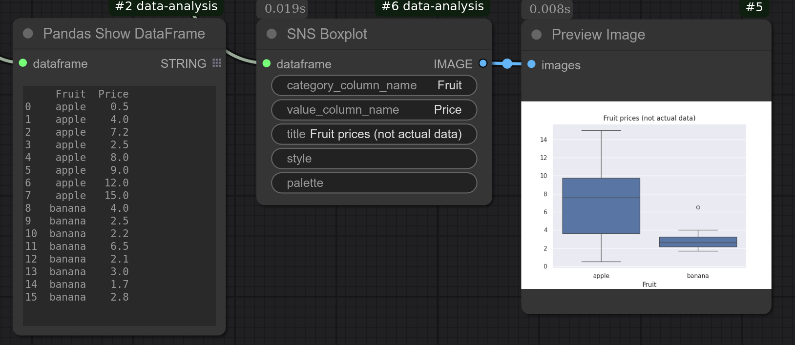

# SNS Boxplot
Generates a boxplot from a Pandas DataFrame using Seaborn.

You can generate a boxplot from either a single column or two columns.  
* For two columns, the first column should contain the category, and the second column should contain the corresponding numerical values.  
* For a wide-format table, use the Pandas Melt node to create a category column first. This column is referred to as the "variable" column in melting.  
* For a single-column dataset, leave the category field blank.

For example, if you have a DataFrame tracking apple and banana prices at various stores:
```
 Fruit  Price
 apple    5
 apple    3
 apple    2
 appel    2.5
 banana   4
 banana   2
 banana   2
```
If you specify `Fruit` as the category and `Price` as the value, two boxplots will be generated: one for apples and one for bananas.



Refer to [Seaborn documentation](https://seaborn.pydata.org/generated/seaborn.boxplot.html) for more information.

## Input
| Name | Data type |
|---|---|
| dataframe | DataFrame |
| category_column_name | String |
| value_column_name | String |
| title | String |
| style | String |
| palette | String |

## Output
| Data type |
|---|
| Image |

<HR>
Category: Plot

ComfyUI Data Analysis Node Reference. © 2025 Hide Inada (HowToSD.com). All rights reserved.
