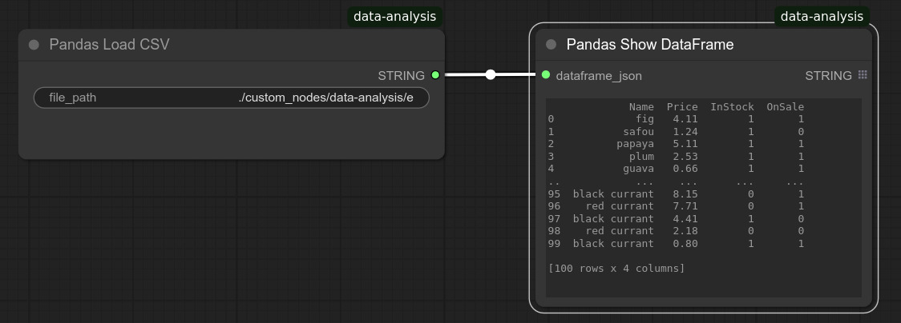
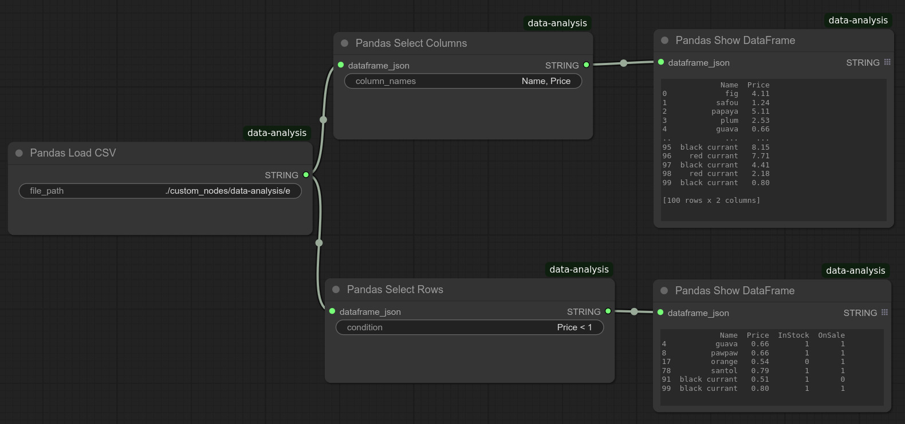
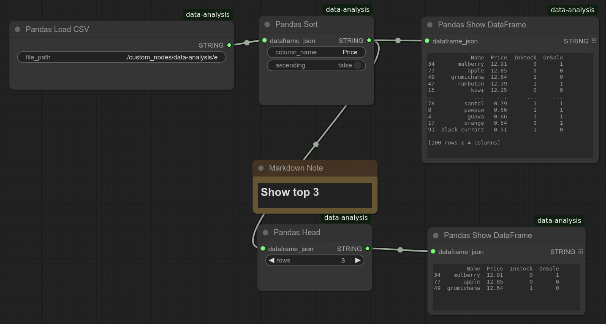

# User's Guide
## Basic Concepts
### How DataFrames is passed between nodes
DataFrames are transmitted as JSON strings. When a DataFrame enters a node, it is reconstructed by deserializing the JSON string. Upon exiting, it is serialized back into a JSON string.

### How to connect nodes for DataFrame JSON strings
To connect the DataFrame JSON string output from one Pandas node to another, move the wire toward the top-left of the text field. You may need to hover around the corner to find the correct connection point.

### How to add a node
You can right-click, select **Add Node**, go to **Data Analysis**, and look for the following nodes:

| Node Name               | Functionality                        |
|-------------------------|-------------------------------------|
| **Pandas Load CSV**     | Load a CSV file                    |
| **Pandas Select Columns** | Select specific columns from a DataFrame |
| **Pandas Select Rows**  | Filter rows based on conditions    |
| **Pandas Join**         | Join two DataFrames                |
| **Pandas Head**         | Extract the first few rows         |
| **Pandas Show DataFrame** | Display DataFrame contents        |
| **Pandas Summary**      | Show DataFrame statistics          |
| **Pandas Sort**         | Sort DataFrame by a column         |
| **Pandas To String**    | Convert DataFrame to a string      |
| **MPL Bar Chart**       | Generate a bar chart               |
| **MPL Line Plot**       | Generate a line plot               |
| **MPL Scatter Plot**    | Generate a scatter plot            |

A faster way is to double-click the canvas to open the node search dialog.

The examples directory contains workflows that load data from an example dataset included in this package. These workflows should give you a good idea about how to use these nodes.

## Loading data
Use **Pandas Load CSV** node to load a CSV.

This will emit the DataFrame in a JSON string.
CSV file path is relative to the ComfyUI installation directory unless you specify the absolute file path.

## Selecting columns and rows
Use **Pandas Select Columns** for selecting columns, **Pandas Select Rows** to select rows by a filter condition.

## Joining DataFrames.
Use **Pandas Join**.  You can select from inner, left, right, outer joins.

## Extract the first few rows
Use **Pandas Head**.

## Displaying DataFrame contents
Use **Pandas Show DataFrame** node. When the number of rows is large, Pandas automatically hides middle rows during string conversion, so the display size should be always manageable.

## Showing Show DataFrame statistics
Use **Pandas Summary**.

## Sorting DataFrame by a column
Use **Pandas Sort**.

## Convert DataFrame to a string
Use **Pandas To String**. This node is to convert the DataFrame to a displayable string, and this truncates the data when the data is large.  This can be used to display the data content in a text display node (e.g. Show Text node). However, you can use Show DataFrame nodes to display the DataFrame content, so you do not normally need to use this.

## Displaying charts or plots
Use one of the below:
| **MPL Bar Chart**       | Generate a bar chart               |
| **MPL Line Plot**       | Generate a line plot               |
| **MPL Scatter Plot**    | Generate a scatter plot            |
