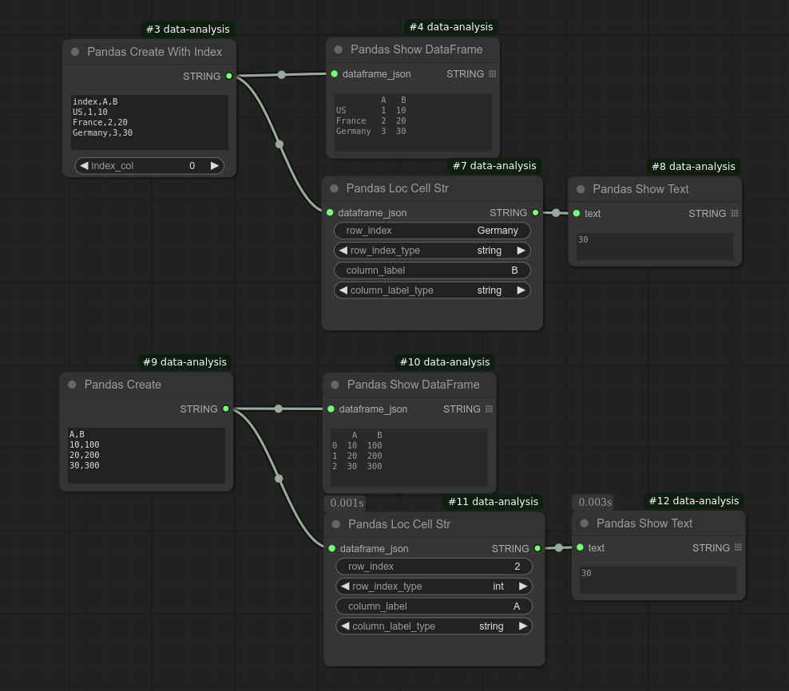

# User's Guide
## Basic Concepts
### How DataFrames is passed between nodes
DataFrames are transmitted as JSON strings. When a DataFrame enters a node, it is reconstructed by deserializing the JSON string. Upon exiting, it is serialized back into a JSON string.

Pandas's Index object is also processed the same way. For example, Pandas Columns and Pandas Index node return labels in a serialized Index format.

### How to connect nodes for DataFrame JSON strings
To connect the DataFrame JSON string output from one Pandas node to another, move the wire toward the top-left of the text field. You may need to hover around the corner to find the correct connection point.

### How to add a node
You can right-click, select **Add Node**, go to **Data Analysis**, and look for the following nodes:

### List of nodes
**Data loading, creation, saving**
| Node Name               | Functionality                        |
|-------------------------|-------------------------------------|
| **Pandas Load CSV**     | Load a CSV file                    |
| **Pandas Load CSV With Encoding**     | Load a CSV file not encoded in utf-8 |
| **Pandas Load CSV With Index**     | Load a CSV file containing index |
| **Pandas Load JSON**     | Load a JSON file                    |
| **Pandas Save CSV**     | Save a DataFrame to a CSV file     |
| **Pandas Save JSON**     | Save a DataFrame to a JSON file     |
| **Pandas Create**     | Create a DataFrame from CSV text field |
| **Pandas Create With Index**     | Create a DataFrame from CSV text field containing index |
| **CDA JSON Create**     | Create JSON from a string entered in a text field |

**Selecting subset of data**
| Node Name               | Functionality                        |
|-------------------------|-------------------------------------|
| **Pandas Columns**      | Extract column labels     |
| **Pandas Index**        | Extract row labels (index)     |
| **Pandas Select Columns** | Select specific columns from a DataFrame |
| **Pandas Select Rows**  | Filter rows based on conditions    |
| **Pandas Iloc Row Series**  | Select a row by row integer position |
| **Pandas Iloc Rows DataFrame**  | Select rows by the list of row integer positions |
| **Pandas Loc Row Series**  | Select a row by row label (index) |
| **Pandas Loc Cell Str**  | Select a cell by row label (index) and column label |
| **Pandas Head**         | Extract the first few rows         |

**Transforming data**
| Node Name               | Functionality                        |
|-------------------------|-------------------------------------|
| **Pandas Group By**     | Group rows and apply aggregation functions |
| **Pandas Join**         | Join two DataFrames                |
| **Pandas Sort**         | Sort DataFrame by a column         |

**Displaying data**
| Node Name               | Functionality                        |
|-------------------------|-------------------------------------|
| **Pandas Show DataFrame** | Display DataFrame contents        |
| **Pandas Show Text**    | Display Text        |
| **Pandas Summary**      | Extract DataFrame statistics          |

**Missing value processing**
| Node Name               | Functionality                        |
|-------------------------|-------------------------------------|
| **Pandas Is NA**  | Check DataFrame for missing values      |
| **Pandas Drop NA**  | Drop missing values from DataFrame    |

**Converting to displayable string**
| Node Name               | Functionality                        |
|-------------------------|-------------------------------------|
| **Pandas Series To String**  | Convert Series to a displayable string      |
| **Pandas To String**    | Convert DataFrame to a displayable string      |

**Plot, chart**
| Node Name               | Functionality                        |
|-------------------------|-------------------------------------|
| **MPL Bar Chart**       | Generate a bar chart               |
| **MPL Line Plot**       | Generate a line plot               |
| **MPL Scatter Plot**    | Generate a scatter plot            |

A faster way is to double-click the canvas to open the node search dialog.

The examples directory contains workflows that load data from an example dataset included in this package. These workflows should give you a good idea about how to use these nodes.

## Loading data
Use **Pandas Load CSV** node to load a CSV, or **Pandas Load CSV With Index** node if the CSV contains an index column.  These nodes assume that the file is encoded in utf-8. If the file is not encoded in utf-8, use **Pandas Load CSV With Encoding** to specify the encoding of the file.  This is necessary if the data was collected before utf-8 encoding became popular.  For example, you can try "latin_1" for a file that contains accented characters in the US and Western Europe.

Use **Pandas Load JSON** node to load a JSON file.

These nodes emit the DataFrame in a JSON string.
CSV file path is relative to the ComfyUI installation directory unless you specify the absolute file path.

## Saving data
Use **Pandas Save CSV** node to save the DataFrame to a CSV file.
Use **Pandas Save JSON** node to save the DataFrame to a JSON file.

## Creating data on the UI
To construct a DataFrame on the UI, use **Pandas Create** or **Pandas Create with Index** nodes. These nodes display the multiline text area where you can enter the data in CSV format.
If the data contains an index column, use **Pandas Create with Index** and specify the index column.

Use **CDA JSON Create** to create JSON from a string entered in a text field.  For example, if you want to create a list for a node that requires the list of integers for input, this node is ideal.

## Extracting column and row labels
Use **Pandas Columns** and **Pandas Index** nodes.  As these nodes output JSON-serialized Index object, to display the value, use **Pandas Show Text** node as shown below:

## Selecting columns and rows
Use **Pandas Select Columns** for selecting columns.
For rows, there are multiple options.
Use **Pandas Select Rows** to select rows by a filter condition.

You can use **Pandas Loc Row Series** to select a row by row label (index).
You can use  **Pandas Iloc Row Series** to select a row by row integer position.
These nodes returns a JSON-serialized Series object.

You can use  **Pandas Iloc Rows DataFrame** to select rows by the list of row integer positions. This node returns a JSON-serialized DataFrame object.
You need to pass the list of integers to this node. This can be done by using the **CDA JSON Create** node.

For  **Pandas Loc Row Series**, data type of the labels needs to be specified as shown below:

For  **Pandas Iloc Row Series**, you only need to specify the row integer position:

Note that in Pandas, integer position is an equivalent of an index in other software,
while "index" means a unique label assigned to each row. See [pandas.DataFrame.iloc.html](https://pandas.pydata.org/docs/reference/api/pandas.DataFrame.iloc.html).

## Selecting a cell by row label (index) and column label
Use **Pandas Loc Cell Str**  for selecting a cell by row label (index) and column label. Data type of the labels needs to be specified as shown below:

This node outputs the cell value as a string irrespective of the actual cell data type.

## Grouping Rows
Use **Pandas Group By** to group rows and apply aggregation functions.
Currently below aggregation functions are supported:
* sum
* mean
* count
* std
* min
* max

Below shows an example of using sum, mean, count functions:

Below shows an example of using std, min, max functions:

You can also have multiple columns to apply aggregation functions. In the below example, Qty and Price columns are aggregated for the Fruit column:

## Joining DataFrames
Use **Pandas Join**.  You can select from inner, left, right, outer joins.
First, use two **Pandas Load CSV** nodes to load two CSVs for the left DataFrame and right DataFrame.

### Inner join
Specify the common column in the "on column name" field, and set the join method to **inner** in the **Pandas Join** node.

### Left join
Specify the common column in the "on column name" field, and set the join method to **left** in the **Pandas Join** node.

### Right join
Specify the common column in the "on column name" field, and set the join method to **right** in the **Pandas Join** node.

### Outer join
Specify the common column in the "on column name" field, and set the join method to **outer** in the **Pandas Join** node.

The workflow file examples/workflows/join.json contains all of the above cases.

## Extract the first few rows
Use **Pandas Head**.

## Missing value processing
Use **Pandas Is NA** for checking DataFrame for missing values, and **Pandas Drop NA** for dropping missing values from DataFrame.

## Display text ##
Use **Pandas Show Text** node.

Currently this node is using the code taken from ComfyUI-Custom-Scripts's Show Text custom node (
https://github.com/pythongosssss/ComfyUI-Custom-Scripts/blob/main/py/show_text.py).
This node has been copied to display text without requiring the user to install the above custom nodes package. However, if you already have ComfyUI-Custom-Scripts, you can also use the Show Text node from the package.

## Displaying DataFrame contents
Use **Pandas Show DataFrame** node. When the number of rows is large, Pandas automatically hides middle rows during string conversion, so the display size should be always manageable.

## Extracting DataFrame statistics
Use **Pandas Summary** to extract statistics then connect the output to **Pandas Show Text** for display.

## Sorting DataFrame by a column
Use **Pandas Sort**.

## Convert DataFrame to a string
Use **Pandas To String**. This node is to convert the DataFrame to a displayable string, and this truncates the data when the data is large.  This can be used to display the data content in a text display node (e.g. Show Text node). However, you can use Show DataFrame nodes to display the DataFrame content, so you do not normally need to use this.

## Convert Series to a string
Use **Pandas Series To String**. This node converts a Pandas Series to a displayable string. You can use this as an input to the **Pandas Show Text** node.

## Displaying charts or plots
Use one of the below:
| Node | Purpose |
|---|---|
| **MPL Bar Chart**       | Generate a bar chart               |
| **MPL Line Plot**       | Generate a line plot               |
| **MPL Scatter Plot**    | Generate a scatter plot            |
