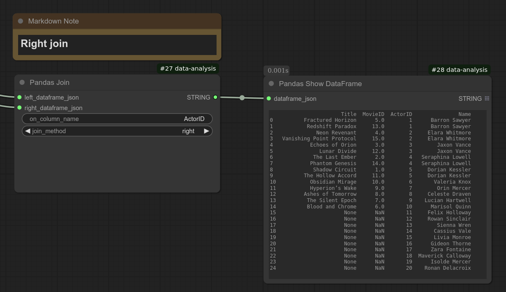

# User's Guide
## Basic Concepts
### How DataFrames is passed between nodes
DataFrames are transmitted as JSON strings. When a DataFrame enters a node, it is reconstructed by deserializing the JSON string. Upon exiting, it is serialized back into a JSON string.

Pandas's Index object is also processed the same way. For example, Pandas Columns and Pandas Index node return labels in a serialized Index format.

### How to connect nodes for DataFrame JSON strings
To connect the DataFrame JSON string output from one Pandas node to another, move the wire toward the top-left of the text field. You may need to hover around the corner to find the correct connection point.

### How to add a node
You can right-click, select **Add Node**, go to **Data Analysis**, and look for the following nodes:

| Node Name               | Functionality                        |
|-------------------------|-------------------------------------|
| **Pandas Load CSV**     | Load a CSV file                    |
| **Pandas Load CSV with Index**     | Load a CSV file containing index |
| **Pandas Save CSV**     | Save a DataFrame to a CSV file     |
| **Pandas Create**     | Create a DataFrame from CSV text field |
| **Pandas Create with Index**     | Create a DataFrame from CSV text field containing index |
| **Pandas Columns**      | Extract column labels     |
| **Pandas Index**        | Extract row labels (index)     |
| **Pandas Select Columns** | Select specific columns from a DataFrame |
| **Pandas Select Rows**  | Filter rows based on conditions    |
| **Pandas Join**         | Join two DataFrames                |
| **Pandas Head**         | Extract the first few rows         |
| **Pandas Show DataFrame** | Display DataFrame contents        |
| **Pandas Show Text**    | Display Text        |
| **Pandas Summary**      | Extract DataFrame statistics          |
| **Pandas Sort**         | Sort DataFrame by a column         |
| **Pandas To String**    | Convert DataFrame to a string      |
| **MPL Bar Chart**       | Generate a bar chart               |
| **MPL Line Plot**       | Generate a line plot               |
| **MPL Scatter Plot**    | Generate a scatter plot            |

A faster way is to double-click the canvas to open the node search dialog.

The examples directory contains workflows that load data from an example dataset included in this package. These workflows should give you a good idea about how to use these nodes.

## Loading data
Use **Pandas Load CSV** node to load a CSV, or **Pandas Load CSV with Index** node if the CSV contains an index column.

This will emit the DataFrame in a JSON string.
CSV file path is relative to the ComfyUI installation directory unless you specify the absolute file path.

## Saving data
Use **Pandas Save CSV** node to save the DataFrame to a CSV file.

## Creating DataFrame on the UI
Use **Pandas Create** or **Pandas Create with Index** nodes. These nodes display the multiline text area where you can enter the data in CSV format.
If the data contains an index column, use **Pandas Create with Index** and specify the index column.

## Extracting column and row labels
Use **Pandas Columns** and **Pandas Index** nodes.  As these nodes output JSON-serialized Index object, to display the value, use **Pandas Show Text** node as shown below:

## Selecting columns and rows
Use **Pandas Select Columns** for selecting columns, **Pandas Select Rows** to select rows by a filter condition.

## Joining DataFrames
Use **Pandas Join**.  You can select from inner, left, right, outer joins.
First, use two **Pandas Load CSV** nodes to load two CSVs for the left DataFrame and right DataFrame.

### Inner join
Specify the common column in the "on column name" field, and set the join method to **inner** in the **Pandas Join** node.

### Left join
Specify the common column in the "on column name" field, and set the join method to **left** in the **Pandas Join** node.

### Right join
Specify the common column in the "on column name" field, and set the join method to **right** in the **Pandas Join** node.

### Outer join
Specify the common column in the "on column name" field, and set the join method to **outer** in the **Pandas Join** node.

The workflow file examples/workflows/join.json contains all of the above cases.

## Extract the first few rows
Use **Pandas Head**.

## Display text ##
Use **Pandas Show Text** node.

Currently this node is using the code taken from ComfyUI-Custom-Scripts's Show Text custom node (
https://github.com/pythongosssss/ComfyUI-Custom-Scripts/blob/main/py/show_text.py).
This node has been copied to display text without requiring the user to install the above custom nodes package. However, if you already have ComfyUI-Custom-Scripts, you can also use the Show Text node from the package.

## Displaying DataFrame contents
Use **Pandas Show DataFrame** node. When the number of rows is large, Pandas automatically hides middle rows during string conversion, so the display size should be always manageable.

## Extracting DataFrame statistics
Use **Pandas Summary** to extract statistics then connect the output to **Pandas Show Text** for display.

## Sorting DataFrame by a column
Use **Pandas Sort**.

## Convert DataFrame to a string
Use **Pandas To String**. This node is to convert the DataFrame to a displayable string, and this truncates the data when the data is large.  This can be used to display the data content in a text display node (e.g. Show Text node). However, you can use Show DataFrame nodes to display the DataFrame content, so you do not normally need to use this.

## Displaying charts or plots
Use one of the below:
| Node | Purpose |
|---|---|
| **MPL Bar Chart**       | Generate a bar chart               |
| **MPL Line Plot**       | Generate a line plot               |
| **MPL Scatter Plot**    | Generate a scatter plot            |
